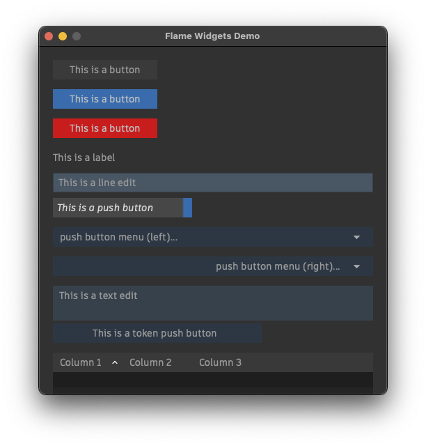

# Flame QT UI Widgets

Snippets of code that can be used to create UI's similar to Flame.
This is heavily inspired py the work of Michael Vaglienty with some custom modifications from Claus Steinmassl.

## Installation:

    pip install git+https://github.com/claussteinmassl/flamewidgets

## Usage:

    from flamewidgets import FlameButton

Run demo.py to see all widgets in action.

